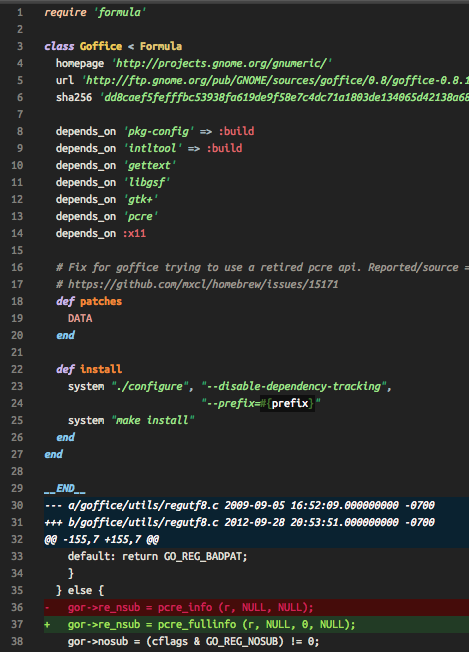

Homebrew-formula-syntax
=======================

Sublime Text 2 and 3 Syntax for Homebrew formulae (supporting the embedded diff)

Homebrew (http://brew.sh) formulae support inlined diffs after an
__END__ keyword. Now, this Syntax desccription you see here, named
"Homebrew Formula.tmLanguage", merges `source.ruby` with `source.diff` and
if you have a [decent color theme](https://github.com/samueljohn/decent) that knows how to highlight diffs, it will make Homebrew formulae more beautiful.

Ruby (.rb) files beginning with `require 'formula'` are automatically
detected.

This tmLanguange here is simple enough - I wrote it directly in xml.

### Note
-   Updates to either source.ruby or source.diff are automatically
    used by this Syntax, too, because they are just included.
-   I copy/pasted (start|stop)foldingStopMarker from
    Ruby.tmLanguage.

### Todo
-   Nothing. Do you have an idea? Let me know!

### Author
-   Samuel John (www.SamuelJohn.de)
    https://github.com/samueljohn/Homebrew-formula-syntax

### License:
Public Domain. I don't care. Have fun.
